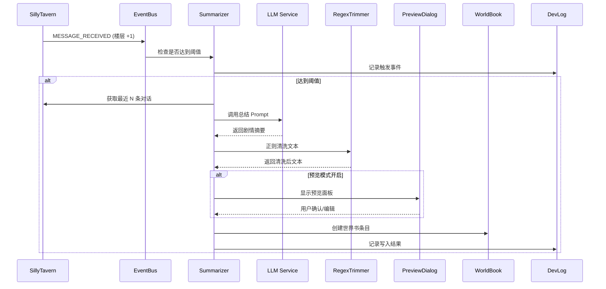

# Feature: 剧情总结模块开发计划

> **模块代号**: `PlotSummarizer`  
> **目标**: 构建一个纯文本模式的双层记忆总结系统，作为 Engram 的基础功能模块

---

## 1. 功能概述

### 1.1 核心目标

为没有向量化模型的用户提供一个 **纯文本双层记忆总结系统**，将对话剧情提炼为结构化的"剧情单元"并存入 SillyTavern 世界书。

### 1.2 双层记忆机制

```
┌─────────────────────────────────────────────────────────────┐
│                        双层记忆系统                          │
├─────────────────────────────────────────────────────────────┤
│                                                             │
│   Layer 1: 总结层 (Summarizer)                              │
│   ┌─────────────────────────────────────────────────────┐   │
│   │  对话块 → [LLM 总结] → 剧情单元 → [正则修剪] → 世界书  │   │
│   └─────────────────────────────────────────────────────┘   │
│                           ↓ (Token 超限时触发)              │
│   Layer 2: 修剪层 (Trimmer)                                 │
│   ┌─────────────────────────────────────────────────────┐   │
│   │  已存储的剧情单元 → [LLM 精简合并] → 压缩后的世界书条目  │   │
│   └─────────────────────────────────────────────────────┘   │
│                                                             │
└─────────────────────────────────────────────────────────────┘
```

| 层级 | 名称 | 触发条件 | 职责 |
|------|------|----------|------|
| **L1** | 总结层 | 楼层计数达到阈值 / 手动触发 | 将对话蒸馏为剧情单元 |
| **L2** | 修剪层 | 世界书 Token 总量超限 | 合并、精简旧的剧情单元 |

### 1.3 与向量化版本的关系

```
纯文本模式 (本次开发)          向量化模式 (未来扩展)
─────────────────────         ─────────────────────
LLM 总结 ◄─────────────────── LLM 总结 (复用)
    ↓                              ↓
正则修剪                       结构化解析
    ↓                              ↓
存入世界书                     存入 DexieDB + 向量化
    ↓                              ↓
LLM 修剪层                     图谱检索 + 重排序
```

---

## 2. 已确认的技术决策

> [!NOTE]
> 以下问题已与用户确认

### ✅ 世界书集成方式

**方案**: 用户可选，支持两种模式：
1. **角色绑定世界书** - 写入角色关联的 World Info
2. **聊天绑定世界书** - 根据聊天文件名生成专属世界书

### ✅ 提示词模板

**方案**: 内置默认模板 + 用户自定义
- 提供开箱即用的总结/修剪模板
- 用户可修改或新建自定义模板

### ✅ Token 计算

**方案**: 复用酒馆自带的 `token_counter` 模块
- 无需额外加载 WASM
- 与酒馆其他功能保持一致

### ✅ 错误通知

**方案**: 使用酒馆原生 `toastr` 通知系统
- LLM 调用失败 → toastr 错误通知
- 世界书写入失败 → toastr 警告通知

### ✅ 设置存储

**方案**: 存入酒馆的 `settings.json`
- 跨浏览器同步用户设置
- 使用 `extension_settings.engram` 命名空间

### ✅ DevLog 集成

**方案**: 所有关键操作输出到 DevLog
- 总结触发、LLM 调用、写入结果等
- 便于调试和用户追踪

---

## 3. 通用功能模块

### 3.1 预览与修订系统 (Preview & Edit)

> [!IMPORTANT]
> 这是一个可复用的通用功能，未来的召回、注入等功能都可使用

**功能描述**:
- 在内容最终写入前，弹出预览面板
- 用户可查看、编辑、确认或取消
- 可选功能，在设置中开关

**UI 设计**:
```
┌─────────────────────────────────────────────────┐
│  📝 预览与修订                          [X]     │
├─────────────────────────────────────────────────┤
│  ┌─────────────────────────────────────────┐    │
│  │  (可编辑的文本区域)                      │    │
│  │  📜 剧情摘要:                           │    │
│  │  玩家与神秘人在酒馆密室会面...           │    │
│  │                                         │    │
│  └─────────────────────────────────────────┘    │
│                                                 │
│  Token 计数: 156                                │
│                                                 │
│         [取消]    [跳过本次]    [确认写入]       │
└─────────────────────────────────────────────────┘
```

**接口设计**:
```typescript
interface PreviewDialogOptions {
  title: string;
  content: string;
  editable: boolean;
  tokenCount?: number;
  onConfirm: (editedContent: string) => Promise<void>;
  onSkip?: () => void;
  onCancel?: () => void;
}

// 使用示例
await showPreviewDialog({
  title: '总结预览',
  content: summaryResult,
  editable: true,
  tokenCount: countTokens(summaryResult),
  onConfirm: async (edited) => {
    await writeToWorldBook(edited);
  }
});
```

### 3.2 世界书操作系统 (WorldBook Manager)

**职责**: 封装所有世界书相关操作

```typescript
interface WorldBookManager {
  // 创建/获取 Engram 专用世界书
  getOrCreateEngramBook(chatId: string): Promise<WorldBook>;
  
  // 条目操作
  createEntry(bookId: string, entry: WorldEntry): Promise<string>;
  updateEntry(bookId: string, entryId: string, content: Partial<WorldEntry>): Promise<void>;
  deleteEntry(bookId: string, entryId: string): Promise<void>;
  
  // 查询
  getEntriesByTag(bookId: string, tag: string): Promise<WorldEntry[]>;
  getTotalTokenCount(bookId: string): Promise<number>;
  
  // 绑定模式
  bindToCharacter(characterId: string): Promise<void>;
  bindToChat(chatFileName: string): Promise<void>;
}
```

---

## 4. 开发路线图

> [!IMPORTANT]
> 采用渐进式开发，先完善基础设施，再构建功能模块

### Phase 0: 基础设施完善

#### 0.1 APIPresets 增强

**当前状态**: 仅支持模型提供商选择  
**目标状态**: 完整的 API + Prompt 预设管理

| 子任务 | 描述 | 状态 |
|--------|------|------|
| 0.1.1 | 提示词模板管理系统 | 待开发 |
| 0.1.2 | 预设与用途绑定（总结/修剪/检索） | 待设计 |
| 0.1.3 | 内置默认模板 | 待开发 |
| 0.1.4 | 预设导入导出 | 待开发 |

**提示词模板系统设计**:
```typescript
interface PromptTemplate {
  id: string;
  name: string;
  category: 'summarize' | 'trim' | 'retrieve' | 'custom';
  isBuiltIn: boolean;           // 是否为内置模板
  systemPrompt: string;
  userPromptTemplate: string;   // 支持变量插槽 {{chatHistory}}, {{context}}
  outputFormat?: 'json' | 'markdown' | 'plain';
  variables: string[];          // 可用变量列表
}

interface APIPreset {
  id: string;
  name: string;
  provider: 'openai' | 'anthropic' | 'ollama' | 'openrouter' | 'custom';
  endpoint: string;
  apiKey?: string;
  model: string;
  // 新增: 绑定的提示词模板
  boundTemplates: {
    summarize?: string; // PromptTemplate ID
    trim?: string;
  };
}
```

#### 0.2 SillyTavern 事件总线

**目标**: 监听酒馆事件，获取对话上下文

| 子任务 | 描述 | 状态 |
|--------|------|------|
| 0.2.1 | 楼层计数监听 (`MESSAGE_RECEIVED`) | 待调研 |
| 0.2.2 | 聊天切换监听 (`CHAT_CHANGED`) | 待调研 |
| 0.2.3 | 获取当前对话历史 API | 待调研 |
| 0.2.4 | Token 计数 API (`token_counter`) | 待调研 |
| 0.2.5 | Toastr 通知 API | 待调研 |

#### 0.3 世界书 API 封装

| 子任务 | 描述 | 状态 |
|--------|------|------|
| 0.3.1 | 世界书 CRUD API | 待调研 |
| 0.3.2 | WorldBookManager 实现 | 待开发 |
| 0.3.3 | 角色/聊天绑定逻辑 | 待开发 |

#### 0.4 设置持久化

| 子任务 | 描述 | 状态 |
|--------|------|------|
| 0.4.1 | 接入酒馆 settings.json | 待调研 |
| 0.4.2 | Engram 设置 Schema 定义 | 待开发 |

---

### Phase 1: 总结层 (Summarizer)

#### 1.1 核心流程



#### 1.2 正则修剪规则

```typescript
const TRIM_RULES = [
  // 移除多余空行
  { pattern: /\n{3,}/g, replacement: '\n\n' },
  // 移除行首行尾空白
  { pattern: /^\s+|\s+$/gm, replacement: '' },
  // 移除 Markdown 代码块标记（保留内容）
  { pattern: /```\w*\n?/g, replacement: '' },
  // 统一引号
  { pattern: /[""]/g, replacement: '"' },
  // 可扩展...
];
```

#### 1.3 世界书条目格式

```
---
🕐 时间: 第3天 下午
📍 地点: 酒馆二楼
🔑 关键词: 密谈, 钥匙, 神秘人
---
📜 剧情摘要:
玩家与神秘人在酒馆密室会面，获得了一把生锈的钥匙...
```

---

### Phase 2: 修剪层 (Trimmer)

#### 2.1 触发机制

```typescript
interface TrimmerConfig {
  enabled: boolean;
  tokenThreshold: number;  // 例如 2000 tokens
  mergeStrategy: 'chronological' | 'importance';
  keepRecentCount: number; // 保留最近 N 条不合并
}
```

#### 2.2 核心逻辑

1. 监控世界书中 Engram 创建的条目总 Token 数
2. 超过阈值时，选取最旧的 M 条进行合并
3. 调用修剪 LLM，输出一条精简后的合并条目
4. 删除原条目，插入新条目
5. 输出日志到 DevLog

---

### Phase 3: 设置界面

#### 3.1 设置项

| 设置项 | 类型 | 默认值 | 说明 |
|--------|------|--------|------|
| 触发模式 | select | `manual` | 手动 / 自动 / 混合 |
| 楼层间隔 | number | 10 | 每隔 N 条对话自动触发 |
| 使用的 API 预设 | select | - | 选择 APIPresets 中的预设 |
| 世界书绑定模式 | select | `chat` | 角色绑定 / 聊天绑定 |
| Token 上限 | number | 2000 | 触发修剪层的阈值 |
| 保留最近条目数 | number | 3 | 修剪时跳过的最新条目 |
| 启用预览 | checkbox | true | 写入前显示预览面板 |

#### 3.2 存储结构

```typescript
// 存入 settings.json 的结构
interface EngramSettings {
  summarizer: {
    triggerMode: 'manual' | 'auto' | 'hybrid';
    floorInterval: number;
    apiPresetId: string;
    worldBookBindMode: 'character' | 'chat';
    enablePreview: boolean;
  };
  trimmer: {
    enabled: boolean;
    tokenThreshold: number;
    keepRecentCount: number;
  };
}
```

#### 3.3 UI 位置

在现有 `Settings` 视图中新增 `SummarizerSection`:

```
Settings/
├── index.tsx
└── sections/
    ├── GeneralSection.tsx
    ├── StorageSection.tsx
    └── SummarizerSection.tsx  ← 新增
```

---

### Phase 4: 总结控制 UI

#### 4.1 Brain 视图改造

在 `Brain/Summarize` 页面添加：

- **状态显示**: 当前楼层计数、距离下次自动触发的剩余
- **手动触发按钮**: 立即执行总结
- **预览区域**: 显示将要总结的对话块
- **历史记录**: 已生成的剧情单元列表

---

## 5. 开发优先级

```
┌─────────────────────────────────────────────────────────────┐
│  Priority 1: 调研阶段                                        │
│  ├── 调研 SillyTavern 事件系统                               │
│  ├── 调研世界书 API                                          │
│  ├── 调研 token_counter 用法                                 │
│  └── 调研 settings.json 存储方式                             │
├─────────────────────────────────────────────────────────────┤
│  Priority 2: 基础设施                                        │
│  ├── APIPresets 提示词模板系统                               │
│  ├── APIPresets UI 增强                                     │
│  └── 事件总线封装 (STBridge)                                 │
├─────────────────────────────────────────────────────────────┤
│  Priority 3: 核心功能                                        │
│  ├── WorldBookManager 实现                                  │
│  ├── Summarizer 核心逻辑                                    │
│  ├── PreviewDialog 通用组件                                 │
│  └── Settings 持久化                                        │
├─────────────────────────────────────────────────────────────┤
│  Priority 4: UI 与体验                                       │
│  ├── Brain/Summarize UI                                     │
│  ├── Settings/SummarizerSection                             │
│  └── DevLog 集成                                            │
├─────────────────────────────────────────────────────────────┤
│  Priority 5: 扩展功能                                        │
│  └── Trimmer 修剪层                                         │
└─────────────────────────────────────────────────────────────┘
```

---

## 6. 下一步行动

- [x] 确认技术决策
- [x] **调研 SillyTavern 源码和文档**
  - [x] 事件系统 (`eventSource`, `event_types`)
  - [x] 世界书 API
  - [x] Token 计数 (`tokenizers`)
  - [x] 设置存储 (`extension_settings`)
  - [x] Toastr 通知
- [x] 细化 APIPresets 增强的具体需求
- [x] 搭建基础框架 (Processing, APIPresets, Prompt System)

---

*文档版本: v0.3*  
*更新日期: 2025-12-28*  
*状态: 基础框架搭建完成，进入核心功能开发*
