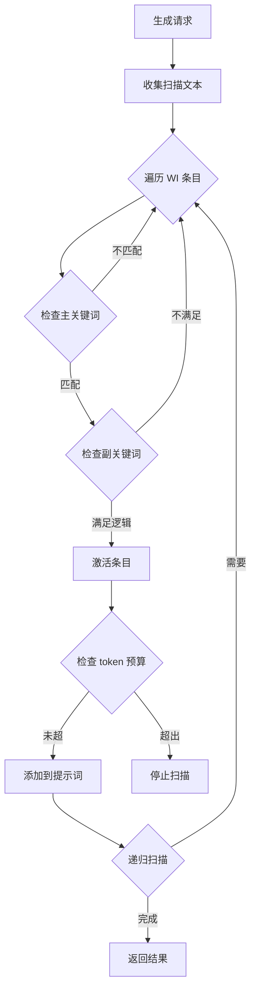

# 上下文工程调研报告

> Engram 在调用 LLM 进行总结、格式化、数据库维护和召回检索时，需要正确处理酒馆的宏系统、世界书触发和正则处理。本文档深入调研这些机制。

---

## 1. 宏系统

### 1.1 核心函数

```javascript
import { substituteParams, substituteParamsExtended } from '../script.js';

// 基础宏替换
const text = substituteParams('你好，{{user}}！我是{{char}}。');
// 输出: "你好，玩家！我是角色。"

// 扩展宏替换（支持自定义宏）
const text = substituteParamsExtended(
  '{{custom}}的值是：{{value}}',
  { custom: 'MyVar', value: 42 }  // 自定义宏
);
```

### 1.2 内置宏类型

| 类别 | 宏示例 | 说明 |
|------|--------|------|
| **基础** | `{{user}}`, `{{char}}`, `{{persona}}` | 角色/用户名称 |
| **角色卡** | `{{description}}`, `{{personality}}`, `{{scenario}}` | 角色卡字段 |
| **消息** | `{{lastMessage}}`, `{{lastUserMessage}}`, `{{lastCharMessage}}` | 聊天历史 |
| **时间** | `{{time}}`, `{{date}}`, `{{isodate}}`, `{{weekday}}` | 时间日期 |
| **功能性** | `{{roll:1d6}}`, `{{random:a,b,c}}`, `{{pick::a::b::c}}` | 随机生成 |
| **变量** | `{{getvar::name}}`, `{{setvar::name::value}}` | 局部变量 |
| **全局变量** | `{{getglobalvar::name}}`, `{{setglobalvar::name::value}}` | 全局变量 |

### 1.3 功能性宏详解

```javascript
// 掷骰子
'{{roll:1d6}}'      // 返回 1-6 的随机数
'{{roll:2d10+5}}'   // 掷 2 个 d10 加 5

// 随机选择
'{{random:选项1,选项2,选项3}}'   // 每次重新随机
'{{pick::选项1::选项2::选项3}}'  // 本次聊天固定

// 条件注释（AI 看不到）
'{{// 这是注释}}'
```

### 1.4 在 Engram 中使用宏

```javascript
// 酒馆助手 API
const replaced = window.TavernHelper.substitudeMacros('{{char}}说：{{roll:1d20}}');

// 或直接使用酒馆导出
import { substituteParams } from '../script.js';
const replaced = substituteParams('角色 {{char}} 的描述：{{description}}');
```

> **关键点**：在调用 LLM 前，必须先对提示词模板进行宏替换，否则 LLM 会看到原始的 `{{char}}` 等未解析内容。

---

## 2. 世界书触发机制

### 2.1 世界书条目扫描流程



### 2.2 扫描文本来源

世界书扫描的文本来源包括：

1. **聊天历史** - 最近 N 条消息（由 `scan_depth` 控制）
2. **扩展提示词** - 设置了 `scan: true` 的 `extensionPrompts`
3. **递归内容** - 已激活条目的内容（如果启用递归扫描）

### 2.3 让扩展提示词参与世界书扫描

```javascript
import { setExtensionPrompt, extension_prompt_types, extension_prompt_roles } from '../script.js';

// 第 5 个参数 allowWIScan 控制是否参与世界书扫描
setExtensionPrompt(
  'ENGRAM_MEMORY',           // 唯一标识
  '记忆内容...',              // 提示词内容
  extension_prompt_types.IN_PROMPT, // 位置
  2,                         // 深度
  true,                      // ⭐ allowWIScan = true，参与 WI 扫描
  extension_prompt_roles.SYSTEM
);
```

### 2.4 世界书条目触发逻辑

```javascript
// 关键词在扫描文本中的匹配逻辑
const selectiveLogic = {
  AND_ANY: 0,   // 主关键词 + 任意副关键词
  AND_ALL: 1,   // 主关键词 + 所有副关键词
  NOT_ANY: 2,   // 主关键词 + 无任何副关键词
  NOT_ALL: 3,   // 主关键词 + 非全部副关键词
};

// 关键词也支持宏替换
// 例如关键词 "{{user}}" 会被替换为实际用户名后再匹配
```

### 2.5 获取已激活并排序的世界书内容

**方法 1：监听 `WORLD_INFO_ACTIVATED` 事件**

```javascript
import { eventSource, event_types } from '../script.js';

// 世界书条目激活后触发，携带所有激活的条目数组
eventSource.on(event_types.WORLD_INFO_ACTIVATED, (activatedEntries) => {
  // activatedEntries 是已激活条目的数组，已按排序规则排列
  console.log('激活的条目数量:', activatedEntries.length);
  
  // 条目内容
  const worldInfoContent = activatedEntries
    .map(entry => entry.content)
    .join('\n');
    
  // 可以存储供 Engram 使用
  window.engramLastWorldInfo = worldInfoContent;
});
```

**方法 2：直接调用 `getWorldInfoPrompt`（更完整）**

```javascript
import { getWorldInfoPrompt } from '../world-info.js';
import { getContext } from '../extensions.js';

async function getActivatedWorldInfo() {
  const context = getContext();
  const chat = context.chat.map(m => m.mes).reverse();  // 反向消息数组
  const maxContext = context.maxContext || 4096;
  
  // 调用世界书扫描（isDryRun=true 不触发事件）
  const result = await getWorldInfoPrompt(chat, maxContext, true, {
    trigger: 'normal'  // 生成类型
  });
  
  // 返回值包含：
  return {
    // 完整的世界书字符串（before + after）
    worldInfoString: result.worldInfoString,
    
    // 分开的位置
    worldInfoBefore: result.worldInfoBefore,  // 角色描述前
    worldInfoAfter: result.worldInfoAfter,    // 角色描述后
    
    // 深度注入的条目
    worldInfoDepth: result.worldInfoDepth,    // [{depth, entries: [], role}]
    
    // 对话示例位置的条目
    worldInfoExamples: result.worldInfoExamples,
    
    // AN 位置的条目
    anBefore: result.anBefore,
    anAfter: result.anAfter,
  };
}
```

**方法 3：在生成事件中获取（推荐）**

```javascript
eventSource.on(event_types.GENERATION_AFTER_COMMANDS, async (type, params, dryRun) => {
  if (dryRun) return;
  
  // 获取当前激活的世界书
  const wi = await getActivatedWorldInfo();
  
  // 使用世界书内容
  const fullWorldInfo = `${wi.worldInfoBefore}\n${wi.worldInfoAfter}`;
});
```

### 2.6 Engram 集成建议


**方案 1：让 Engram 的记忆注入参与 WI 扫描**

```javascript
// 记忆内容可能包含触发其他 WI 条目的关键词
setExtensionPrompt(
  'ENGRAM_MEMORY',
  formattedMemories,
  extension_prompt_types.IN_PROMPT,
  settings.depth,
  true,  // 参与 WI 扫描
  extension_prompt_roles.SYSTEM
);
```

**方案 2：独立调用 LLM 时手动获取世界书**

```javascript
import { getSortedEntries } from '../world-info.js';

// 获取所有已排序的世界书条目
const entries = await getSortedEntries();

// 筛选激活的条目（constant 类型始终激活）
const constantEntries = entries.filter(e => e.constant && !e.disable);

// 手动构建世界书内容
const worldInfoContent = constantEntries
  .map(e => e.content)
  .join('\n');
```

---

## 3. 正则处理系统

### 3.1 正则引擎架构

```javascript
// 正则应用场景 (regex_placement)
const regex_placement = {
  MD_DISPLAY: 0,    // 已弃用
  USER_INPUT: 1,    // 用户输入
  AI_OUTPUT: 2,     // AI 输出
  SLASH_COMMAND: 3, // 斜线命令
  WORLD_INFO: 5,    // 世界书
  REASONING: 6,     // 推理内容
};
```

### 3.2 正则脚本结构

```typescript
type TavernRegex = {
  id: string;
  script_name: string;
  enabled: boolean;
  find_regex: string;      // 查找正则
  replace_string: string;  // 替换内容
  source: {                // 作用范围
    user_input: boolean;
    ai_output: boolean;
    slash_command: boolean;
    world_info: boolean;
  };
  destination: {           // 应用目标
    display: boolean;      // 仅格式显示
    prompt: boolean;       // 仅格式提示词
  };
  min_depth: number | null;  // 最小深度
  max_depth: number | null;  // 最大深度
  trimStrings: string[];     // 要修剪的内容
};
```

### 3.3 删除 `<think>` 和 `<var_update>` 标签

典型的正则配置：

```javascript
// 删除 <think> 标签及其内容
{
  find_regex: '<think>[\\s\\S]*?</think>',
  replace_string: '',
  source: { ai_output: true },
  destination: { display: true }  // 仅显示时删除
}

// 删除 <var_update> 标签及其内容
{
  find_regex: '<var_update>[\\s\\S]*?</var_update>',
  replace_string: '',
  source: { ai_output: true },
  destination: { display: true }
}
```

### 3.4 获取处理前的原始内容

**关键：消息对象中 `mes` 是原始内容，`extra.display_text` 是处理后的显示内容**

```javascript
// 消息结构
const message = {
  mes: '原始 AI 回复内容（包含 <think> 等标签）',
  extra: {
    display_text: '处理后的显示内容（已删除标签）'
  }
};

// 获取原始内容（未经正则处理）
const originalContent = message.mes;

// 获取显示内容（已经正则处理）
const displayContent = message.extra?.display_text || message.mes;
```

### 3.5 酒馆助手的正则 API

```typescript
// 手动应用正则到文本
const result = window.TavernHelper.formatAsTavernRegexedString(
  text,
  'ai_output',  // 来源：user_input | ai_output | slash_command | world_info | reasoning
  'display',    // 目标：display | prompt
  { depth: 0 }  // 可选：深度
);

// 获取所有正则
const regexes = window.TavernHelper.getTavernRegexes({
  scope: 'all',      // 'all' | 'global' | 'character'
  enable_state: 'enabled'  // 'all' | 'enabled' | 'disabled'
});

// 更新正则
await window.TavernHelper.updateTavernRegexesWith(regexes => {
  return regexes.map(r => ({ ...r, enabled: true }));
});
```

### 3.6 直接调用酒馆正则引擎（推荐）

酒馆导出了 `getRegexedString` 函数，可以直接使用酒馆配置的正则：

```javascript
import { getRegexedString, regex_placement } from '../extensions/regex/engine.js';

// regex_placement 枚举
const regex_placement = {
  MD_DISPLAY: 0,    // 已弃用
  USER_INPUT: 1,    // 用户输入
  AI_OUTPUT: 2,     // AI 输出 ← 用于处理带 <think> 的回复
  SLASH_COMMAND: 3, // 斜线命令
  WORLD_INFO: 5,    // 世界书
  REASONING: 6,     // 推理内容
};

// 应用酒馆正则（会使用酒馆已配置的删除 <think> 等正则）
const processedText = getRegexedString(
  rawText,                      // 原始文本
  regex_placement.AI_OUTPUT,    // 来源类型
  {
    isMarkdown: false,          // 是否用于 Markdown 显示
    isPrompt: false,            // 是否用于提示词
    depth: 0,                   // 消息深度（可选）
    isEdit: false               // 是否为编辑操作
  }
);
```

### 3.7 Engram 中兼容酒馆正则

```javascript
import { getRegexedString, regex_placement } from '../extensions/regex/engine.js';

// 场景 1：处理 AI 回复用于总结
function processMessageForSummarization(message, depth = 0) {
  const raw = message.mes;
  
  // 使用酒馆正则处理（会自动应用删除 <think> 等配置）
  const processed = getRegexedString(raw, regex_placement.AI_OUTPUT, {
    isPrompt: true,  // 用于提示词
    depth: depth
  });
  
  return processed;
}

// 场景 2：获取处理前的原始内容（保留 <think> 用于分析）
function getRawMessageContent(message) {
  return message.mes;  // 原始内容不经过正则处理
}

// 场景 3：分别获取原始和处理后的内容
function getMessageContents(message, depth = 0) {
  const raw = message.mes;
  
  // 处理后的内容（应用酒馆正则）
  const processed = getRegexedString(raw, regex_placement.AI_OUTPUT, {
    isPrompt: true,
    depth: depth
  });
  
  // 手动提取 <think> 内容（正则删除前）
  const thinkMatch = raw.match(/<think>([\s\S]*?)<\/think>/);
  const thinking = thinkMatch ? thinkMatch[1].trim() : null;
  
  return { raw, processed, thinking };
}
```

### 3.8 Engram 中如何处理


**场景：Engram 需要总结带 `<think>` 标签的 AI 回复**

```javascript
// 方案 1：使用原始内容（获取 <think> 标签内的推理内容）
function getMessageContent(message, includeThinking = false) {
  const rawContent = message.mes;
  
  if (includeThinking) {
    // 提取 <think> 标签内容
    const thinkMatch = rawContent.match(/<think>([\s\S]*?)<\/think>/);
    const thinking = thinkMatch ? thinkMatch[1] : '';
    const mainContent = rawContent.replace(/<think>[\s\S]*?<\/think>/g, '').trim();
    return { thinking, mainContent };
  }
  
  // 返回去除标签后的内容
  return rawContent.replace(/<think>[\s\S]*?<\/think>/g, '').trim();
}

// 方案 2：使用酒馆正则处理后的内容
function getDisplayContent(message) {
  return message.extra?.display_text || message.mes;
}
```

**场景：提取 `<var_update>` 中的结构化数据**

```javascript
function extractVarUpdates(message) {
  const raw = message.mes;
  const matches = raw.matchAll(/<var_update>([\s\S]*?)<\/var_update>/g);
  
  const updates = [];
  for (const match of matches) {
    try {
      // 假设内容是 JSON 格式
      updates.push(JSON.parse(match[1]));
    } catch {
      updates.push(match[1]);  // 非 JSON，保留原文
    }
  }
  
  return updates;
}
```

---

## 4. Engram 集成总结

### 4.1 LLM 调用前的处理流程

```javascript
async function prepareLLMPrompt(template, options = {}) {
  // 1. 宏替换
  let prompt = substituteParams(template);
  
  // 2. 如果需要世界书设定
  if (options.includeWorldInfo) {
    const entries = await getSortedEntries();
    const constantEntries = entries.filter(e => e.constant && !e.disable);
    prompt += '\n' + constantEntries.map(e => e.content).join('\n');
  }
  
  return prompt;
}
```

### 4.2 记忆注入时机

```javascript
import { eventSource, event_types } from '../script.js';

// 监听生成事件
eventSource.on(event_types.GENERATION_AFTER_COMMANDS, async (type, params, dryRun) => {
  if (dryRun) return;
  
  // 检索记忆
  const memories = await retrieveRelevantMemories();
  
  // 对记忆内容进行宏替换
  const formattedMemories = substituteParams(formatMemories(memories));
  
  // 注入提示词（参与 WI 扫描）
  setExtensionPrompt(
    'ENGRAM_MEMORY',
    formattedMemories,
    extension_prompt_types.IN_PROMPT,
    settings.depth,
    true,  // allowWIScan
    extension_prompt_roles.SYSTEM
  );
});
```

### 4.3 处理带特殊标签的消息

```javascript
// 在 Engram 内部处理消息时
function processMessageForSummarization(message) {
  const raw = message.mes;
  
  // 提取思考内容（可选择性保留）
  const thinkingContent = extractTagContent(raw, 'think');
  
  // 提取变量更新（用于数据库维护）
  const varUpdates = extractTagContent(raw, 'var_update');
  
  // 获取主体内容
  const mainContent = raw
    .replace(/<think>[\s\S]*?<\/think>/g, '')
    .replace(/<var_update>[\s\S]*?<\/var_update>/g, '')
    .trim();
  
  return { mainContent, thinkingContent, varUpdates };
}

function extractTagContent(text, tagName) {
  const regex = new RegExp(`<${tagName}>([\\s\\S]*?)</${tagName}>`, 'g');
  const matches = [...text.matchAll(regex)];
  return matches.map(m => m[1].trim());
}
```

---

## 5. 参考资源

- 宏列表文档: `docs/sillytavern以及酒馆助手提供的api和宏/酒馆宏.txt`
- 正则引擎: `/public/scripts/extensions/regex/engine.js`
- 世界书处理: `/public/scripts/world-info.js` (`checkWorldInfo` 函数)
- 宏替换: `/public/script.js` (`substituteParams`, `substituteParamsExtended`)
- 酒馆助手 API: `window.TavernHelper`
