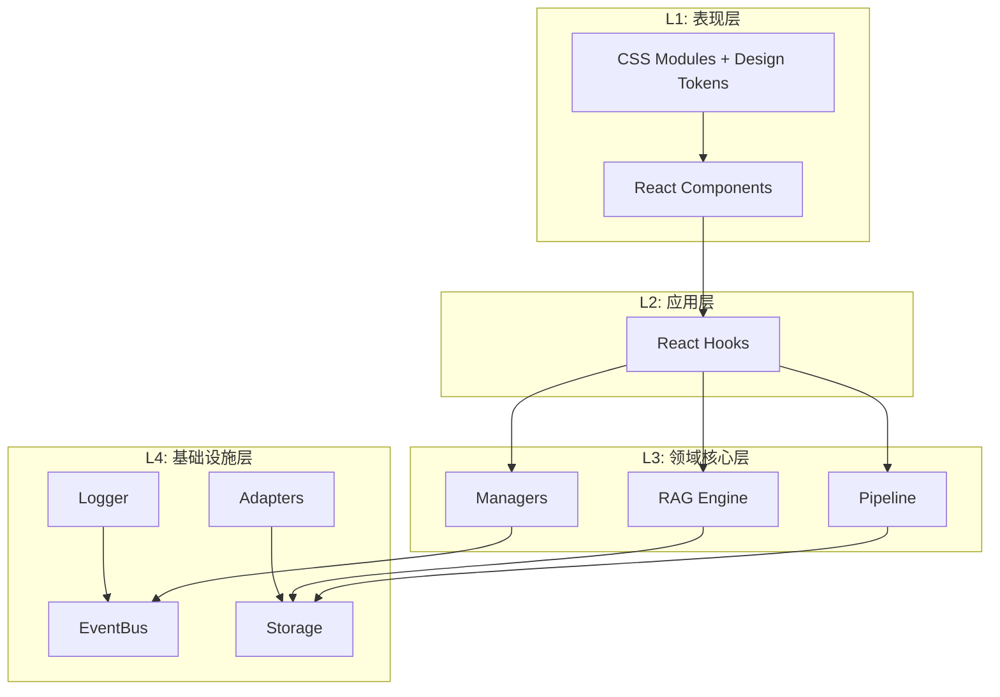

# Engram 工程目录结构指南

> 此目录结构基于 **React + Vite + TypeScript**，采用 **DDD (领域驱动设计)** 分层，将核心逻辑与 UI 彻底解耦。

---

## 📁 目录结构总览

```
/
├── assets/                    # 静态资源
│   └── logo/                  # Logo 文件
│       ├── Engram_icon.svg    # 图标 (悬浮球)
│       ├── Engram_logo.svg    # 完整 logo (面板头部)
│       └── Engram_textlogo.svg# 文字 logo
│
├── src/
│   │
│   │   // ═══ L4: 基础设施层 (Infrastructure) ═══
│   ├── infrastructure/
│   │   ├── bus/               # 事件总线 (RxJS)
│   │   │   └── EventBus.ts    
│   │   ├── storage/           # 数据库适配器
│   │   │   ├── DexieDB.ts     # IndexedDB 实例 (Graph Storage)
│   │   │   └── VectorDB.ts    # Voy 实例 (Vector Storage)
│   │   ├── logger/            # 日志系统
│   │   │   └── index.ts       # 统一日志管理器
│   │   └── adapter/           # 外部系统适配器
│   │       ├── STBridge.ts    # SillyTavern API 桥接 (jQuery Hooks)
│   │       └── LLMAdapter.ts  # 统一 LLM 调用接口
│   │
│   │   // ═══ L3: 领域核心层 (Domain / Core) ═══
│   ├── core/
│   │   ├── pipeline/          # 数据处理流水线
│   │   │   ├── Pipeline.ts    # 管道控制器
│   │   │   ├── steps/
│   │   │   │   ├── Summarizer.ts  # LLM 总结 & 实体提取
│   │   │   │   ├── GraphBuilder.ts# 构建图谱节点与边
│   │   │   │   └── Vectorizer.ts  # 计算 Embedding
│   │   │
│   │   ├── rag/               # RAG 核心算法
│   │   │   ├── Retriever.ts   # 混合检索器 (Graph + Vector)
│   │   │   └── Reranker.ts    # 重排序逻辑
│   │   │
│   │   ├── manager/           # 状态管理器
│   │   │   ├── BrainManager.ts # 分脑逻辑 (Context Switching)
│   │   │   └── ConfigManager.ts# 配置持久化
│   │   │
│   │   └── types/             # 领域模型定义
│   │       ├── graph.d.ts     # EntityNode, EventNode 定义
│   │       └── events.d.ts    # 系统事件定义
│   │
│   │   // ═══ L2: 应用层 (Application / Hooks) ═══
│   ├── hooks/
│   │   ├── useGraphData.ts    # 订阅图谱数据 (用于 React Flow)
│   │   ├── useMemoryStream.ts # 订阅记忆流 (用于列表展示)
│   │   └── useIngestion.ts    # 控制摄入状态
│   │
│   │   // ═══ L1: 表现层 (Presentation / UI) ═══
│   ├── views/                 # 视图组件（每个视图独立样式）
│   │   ├── Layout/            # 布局容器
│   │   │   ├── index.tsx      
│   │   │   ├── Header.tsx     
│   │   │   └── Sidebar/       
│   │   ├── Dashboard/         # 仪表盘
│   │   │   ├── index.tsx      
│   │   │   ├── components/    # 子组件
│   │   │   └── styles/        # 视图专属样式
│   │   │       └── index.css  
│   │   ├── DevLog/            # 开发日志（CSS Modules）
│   │   │   ├── index.tsx      
│   │   │   ├── LogEntryItem.tsx
│   │   │   └── styles/
│   │   │       └── index.module.css
│   │   ├── APIPresets/        # API 预设管理
│   │   │   ├── index.tsx      
│   │   │   ├── styles.css     # 视图容器样式
│   │   │   ├── types.ts       # 类型定义
│   │   │   └── components/    # 组件（全部 CSS Modules）
│   │   │       ├── FormField/
│   │   │       │   ├── index.tsx
│   │   │       │   └── styles.module.css
│   │   │       ├── PresetCard/
│   │   │       ├── LLMPresetForm/
│   │   │       ├── VectorConfigForm/
│   │   │       └── RerankConfigForm/
│   │   ├── MemoryStream/      # 记忆流
│   │   ├── GraphView/         # 图谱可视化
│   │   ├── Brain/             # 大脑控制台
│   │   └── Settings/          # 设置
│   │
│   ├── App.tsx                # 根组件 + 路由
│   ├── main.tsx               # 入口 (Mount Logic)
│   │
│   │   // ═══ 样式系统 ═══
│   └── styles/
│       ├── main.css           # 主入口（导入其他模块 + 核心布局）
│       ├── variables.css      # Design Token 系统
│       └── components.css     # 共享 UI 组件样式
│
├── dist/                      # 构建输出
│   ├── index.js               # 打包后的 JS
│   └── style.css              # 打包后的 CSS
│
├── docs/                      # 项目文档
├── manifest.json              # ST 插件清单
├── vite.config.ts             # Vite 配置 (Library Mode)
├── tailwind.config.js         # Tailwind 配置 (eg- 前缀)
├── postcss.config.js          # PostCSS 配置
├── tsconfig.json
└── package.json
```

---

## 🎨 样式系统架构

### 文件组织

| 文件路径 | 用途 | 行数 |
|----------|------|------|
| `src/styles/main.css` | 样式入口 + 核心布局 | ~535 行 |
| `src/styles/variables.css` | Design Token 系统 | ~94 行 |
| `src/styles/components.css` | 共享 UI 组件 | ~196 行 |
| `views/*/styles/*.css` | 视图专属样式 | 按需 |
| `components/**/styles.module.css` | 组件 CSS Modules | 按需 |

### Design Token 系统 (`variables.css`)

所有设计变量集中定义，使用 `--engram-` 前缀：

```css
:root {
    /* 品牌色 */
    --engram-primary: #f97316;
    --engram-gradient: linear-gradient(135deg, #f97316, #ec4899);
    
    /* 语义色 */
    --engram-success: #22c55e;
    --engram-warning: #facc15;
    --engram-error: #ef4444;
    
    /* 背景层级 */
    --engram-bg-base: rgba(30, 30, 35, 0.95);
    --engram-bg-surface: rgba(255, 255, 255, 0.03);
    --engram-bg-hover: rgba(255, 255, 255, 0.05);
    
    /* 间距 */
    --engram-space-1: 4px;
    --engram-space-2: 8px;
    --engram-space-3: 12px;
    --engram-space-4: 16px;
    
    /* 圆角 */
    --engram-radius-sm: 4px;
    --engram-radius-md: 6px;
    --engram-radius-lg: 8px;
}
```

---

## 📝 新建文件规范

### 新建组件

1. **创建组件文件夹**（在对应 view 的 `components/` 下）：
   ```
   ComponentName/
   ├── index.tsx           # 组件逻辑
   └── styles.module.css   # 组件样式 (CSS Modules)
   ```

2. **导入样式**：
   ```tsx
   import styles from './styles.module.css';
   
   export const MyComponent = () => (
       <div className={styles.container}>
           <h2 className={styles.title}>标题</h2>
       </div>
   );
   ```

3. **使用共享样式**（按钮、下拉菜单等）：
   ```tsx
   // 共享类使用字符串，不需要 import
   <button className="engram-btn engram-btn-primary">
       保存
   </button>
   ```

### 新建视图

1. **创建视图文件夹**（在 `src/views/` 下）：
   ```
   ViewName/
   ├── index.tsx           # 视图主组件
   ├── components/         # 视图专属子组件
   └── styles/
       └── index.css       # 视图样式（或 .module.css）
   ```

2. **在 main.css 中导入**：
   ```css
   @import '../views/ViewName/styles/index.css';
   ```

3. **在 App.tsx 中注册路由**：
   ```tsx
   const ROUTES = {
       '/viewname': ViewName,
   };
   ```

---

## 🎨 CSS 编写规范

### CSS Modules 命名规范

```css
/* styles.module.css */

/* ✅ 使用 camelCase */
.container { }
.formField { }
.buttonPrimary { }

/* ❌ 避免 kebab-case（JS 中不方便调用） */
.form-field { }  /* 需要 styles['form-field'] */
```

### Design Token 使用

```css
/* ✅ 使用 Design Token */
.myComponent {
    background: var(--engram-bg-surface);
    padding: var(--engram-space-3);
    border-radius: var(--engram-radius-md);
    color: var(--engram-text-primary);
}

/* ❌ 避免硬编码颜色值 */
.myComponent {
    background: rgba(255, 255, 255, 0.03);  /* 应使用变量 */
}
```

### 共享样式类清单

| 类名 | 用途 |
|------|------|
| `.engram-btn` | 基础按钮 |
| `.engram-btn-ghost` | 透明按钮 |
| `.engram-btn-primary` | 主要按钮（渐变） |
| `.engram-dropdown` | 下拉菜单容器 |
| `.engram-dropdown-menu` | 下拉菜单面板 |
| `.engram-search-box` | 搜索框 |
| `.engram-tabs` / `.engram-tab` | 标签页 |
| `.engram-page-header` | 页面标题头 |
| `.engram-icon-btn` | 图标按钮 |

---

## 🔑 关键模块职责说明

### 1. `src/styles/main.css`

> **样式系统入口 + 核心布局**

| 项目 | 说明 |
|------|------|
| **职责** | 1. 导入 Design Token 和共享组件样式<br>2. 导入各视图样式<br>3. 定义核心布局（Layout/Header/Sidebar）<br>4. 定义全屏模式和移动端适配 |

### 2. `src/styles/variables.css`

> **Design Token 系统 - 单一真相来源**

| 项目 | 说明 |
|------|------|
| **职责** | 集中定义所有设计变量（颜色、间距、圆角、阴影、动画等），确保全局一致性 |

### 3. `src/styles/components.css`

> **共享 UI 组件样式**

| 项目 | 说明 |
|------|------|
| **职责** | 定义可复用的通用组件样式（按钮、下拉菜单、搜索框、标签页等），被多个视图共享 |

### 4. `src/views/*/styles/`

> **视图专属样式**

| 项目 | 说明 |
|------|------|
| **职责** | 每个视图的专属样式，不与其他视图共享。可以是普通 CSS 或 CSS Modules |

### 5. `src/views/*/components/**/styles.module.css`

> **组件 CSS Modules - 自动作用域隔离**

| 项目 | 说明 |
|------|------|
| **职责** | 组件级样式，通过 CSS Modules 自动生成唯一类名，避免全局污染 |

---

## 📊 分层架构图



---

## 🎨 UI 资源说明

### Logo 资源

| 文件 | 用途 | 位置 |
|------|------|------|
| `Engram_icon.svg` | 悬浮球图标 | `assets/logo/` |
| `Engram_logo.svg` | 面板头部完整 logo | `assets/logo/` |
| `Engram_textlogo.svg` | 纯文字 logo | `assets/logo/` |

### 图标库 - Lucide React

使用 [Lucide](https://lucide.dev/) 作为 UI 图标库，支持 Tree-shaking，按需导入。

**使用方式**：
```tsx
import { X, Search, Settings, Brain, Database, Network } from 'lucide-react';

<X size={16} className={styles.closeIcon} />
```