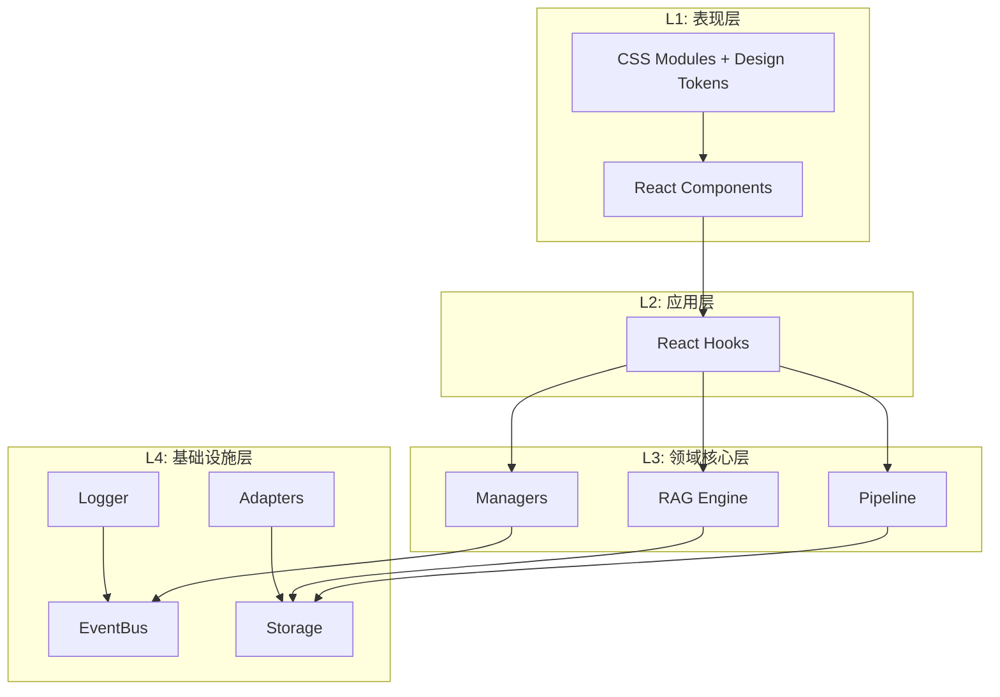

# Engram 工程目录结构指南

> 此目录结构基于 **React + Vite + TypeScript**，采用 **DDD (领域驱动设计)** 分层，将核心逻辑与 UI 彻底解耦。

---

## 📁 目录结构总览

```
/
├── assets/                    # 静态资源
│   └── logo/                  # Logo 文件
│       ├── Engram_icon.svg    # 图标 (悬浮球)
│       ├── Engram_logo.svg    # 完整 logo (面板头部)
│       └── Engram_textlogo.svg# 文字 logo
│
├── src/
│   │
│   │   // ═══ L4: 基础设施层 (Infrastructure) ═══
│   ├── infrastructure/
│   │   ├── bus/               # 事件总线 (RxJS)
│   │   │   └── EventBus.ts    
│   │   ├── storage/           # 数据库适配器
│   │   │   ├── DexieDB.ts     # IndexedDB 实例 (Graph Storage)
│   │   │   └── VectorDB.ts    # Voy 实例 (Vector Storage)
│   │   ├── logger/            # 日志系统
│   │   │   └── index.ts       # 统一日志管理器
│   │   └── adapter/           # 外部系统适配器
│   │       ├── STBridge.ts    # SillyTavern API 桥接 (jQuery Hooks)
│   │       └── LLMAdapter.ts  # 统一 LLM 调用接口
│   │
│   │   // ═══ L3: 领域核心层 (Domain / Core) ═══
│   ├── core/
│   │   ├── pipeline/          # 数据处理流水线
│   │   │   ├── Pipeline.ts    # 管道控制器
│   │   │   ├── steps/
│   │   │   │   ├── Summarizer.ts  # LLM 总结 & 实体提取
│   │   │   │   ├── GraphBuilder.ts# 构建图谱节点与边
│   │   │   │   └── Vectorizer.ts  # 计算 Embedding
│   │   │
│   │   ├── rag/               # RAG 核心算法
│   │   │   ├── Retriever.ts   # 混合检索器 (Graph + Vector)
│   │   │   └── Reranker.ts    # 重排序逻辑
│   │   │
│   │   ├── manager/           # 状态管理器
│   │   │   ├── BrainManager.ts # 分脑逻辑 (Context Switching)
│   │   │   └── ConfigManager.ts# 配置持久化
│   │   │
│   │   └── types/             # 领域模型定义
│   │       ├── graph.d.ts     # EntityNode, EventNode 定义
│   │       └── events.d.ts    # 系统事件定义
│   │
│   │   // ═══ L2: 应用层 (Application / Hooks) ═══
│   ├── hooks/
│   │   ├── useGraphData.ts    # 订阅图谱数据 (用于 React Flow)
│   │   ├── useMemoryStream.ts # 订阅记忆流 (用于列表展示)
│   │   └── useIngestion.ts    # 控制摄入状态
│   │
│   │   // ═══ L1: 表现层 (Presentation / UI) ═══
│   ├── views/                 # 视图组件（每个视图独立样式）
│   │   ├── Layout/            # 布局容器
│   │   │   ├── index.tsx      
│   │   │   ├── Header.tsx     
│   │   │   └── Sidebar/       
│   │   ├── Dashboard/         # 仪表盘
│   │   │   ├── index.tsx      
│   │   │   └── components/    # 子组件
│   │   ├── DevLog/            # 开发日志
│   │   │   ├── index.tsx      
│   │   │   └── LogEntryItem.tsx
│   │   ├── APIPresets/        # API 预设管理
│   │   │   ├── index.tsx      
│   │   │   ├── types.ts       # 类型定义
│   │   │   └── components/    # 组件
│   │   │       ├── FormField/
│   │   │       │   └── index.tsx
│   │   │       ├── PresetCard/
│   │   │       ├── LLMPresetForm/
│   │   │       ├── VectorConfigForm/
│   │   │       └── RerankConfigForm/
│   │   ├── MemoryStream/      # 记忆流
│   │   ├── GraphView/         # 图谱可视化
│   │   ├── Brain/             # 大脑控制台
│   │   └── Settings/          # 设置
│   │
│   ├── App.tsx                # 根组件 + 路由
│   ├── main.tsx               # 入口 (Mount Logic)
│   │
│   │   // ═══ 样式系统 ═══
│   └── styles/
│       ├── main.css           # 主入口（导入其他模块 + 核心布局）
│       └── variables.css      # Design Token 系统
│
├── dist/                      # 构建输出
│   ├── index.js               # 打包后的 JS
│   └── style.css              # 打包后的 CSS
│
├── docs/                      # 项目文档
├── manifest.json              # ST 插件清单
├── vite.config.ts             # Vite 配置 (Library Mode)
├── tailwind.config.js         # Tailwind 配置 (eg- 前缀)
├── postcss.config.js          # PostCSS 配置
├── tsconfig.json
└── package.json
```

---

## 🎨 样式系统架构

### 文件组织

| 文件路径 | 用途 | 说明 |
|----------|------|------|
| `src/styles/main.css` | 核心样式入口 | 包含 Tailwind 指令、全局重置、及 `@layer components` 通用类 |
| `src/styles/variables.css` | Design Tokens | 仅定义 `--engram-` 变量，自动映射为 Tailwind Theme |
| `*.tsx` | 视图/组件样式 | 采用 **Locality of Behavior**，直接在 JSX 中写 Tailwind 类名 |

### Design Token 系统 (`variables.css`)

所有设计变量集中定义，使用 `--engram-` 前缀。`tailwind.config.js` 会自动通过 `var(--engram-...)` 引用这些变量。

```css
:root {
    /* 品牌色 */
    --engram-primary: #f97316;
    --engram-gradient: linear-gradient(135deg, #f97316, #ec4899);
    
    /* 语义色 */
    --engram-success: #22c55e;
    --engram-warning: #facc15;
    --engram-error: #ef4444;
    
    /* 背景层级 */
    --engram-bg-base: rgba(30, 30, 35, 0.95);
    --engram-bg-surface: rgba(255, 255, 255, 0.03);
    --engram-bg-hover: rgba(255, 255, 255, 0.05);
    
    /* 间距 */
    --engram-space-1: 4px;
    --engram-space-2: 8px;
    /* ... 更多变量 ... */
}
```

---

## 📝 新建文件规范

### 新建组件 (Tailwind LoB 模式)

1. **创建组件文件夹**（在对应 view 的 `components/` 下）：
   ```
   ComponentName/
   ├── index.tsx           # 组件逻辑 + 内联样式
   ```

2. **编写组件** (直接使用 Tailwind 类名):
   ```tsx
   export const MyComponent = () => (
       <div className="p-4 bg-bg-surface rounded-md border border-border-light hover:shadow-md transition-all">
           <h2 className="text-xl font-bold text-text-primary">标题</h2>
       </div>
   );
   ```

3. **使用共享样式** (在 `main.css` 中定义):
   ```tsx
   <button className="engram-btn engram-btn-primary">
       保存
   </button>
   ```

### 新建视图

1. **创建视图文件夹**（在 `src/views/` 下）：
   ```
   ViewName/
   ├── index.tsx           # 视图主组件
   └── components/         # 视图专属子组件
   ```

2. **在 App.tsx 中注册路由**。

---

## 🎨 CSS 编写规范

### Tailwind CSS 工具类优先

**不推荐 (Anti-Pattern)**:
```css
/* Avoid creating custom classes unless necessary */
.card-container {
    padding: 1rem;
    background: #fff;
}
```

**推荐 (Best Practice)**:
```tsx
/* Use utility classes directly */
<div className="p-4 bg-white rounded-lg shadow-sm">
    ...
</div>
```

### 共享样式类清单 (`@layer components`)

这些类定义在 `src/styles/main.css` 中，用于保持 UI 一致性：

| 类名 | 对应 Tailwind 组合 | 用途 |
|------|-----------------------|------|
| `.engram-btn` | `inline-flex items-center ...` | 基础按钮容器 |
| `.engram-btn-ghost` | `bg-transparent hover:bg-bg-hover ...` | 幽灵按钮 |
| `.engram-btn-primary` | `bg-gradient ... text-white` | 主要按钮 |
| `.engram-card` | `bg-bg-surface backdrop-blur-md ...` | 通用卡片样式 |
| `.engram-page-header` | `flex items-center border-b ...` | 页面标题栏 |
| `.engram-icon-btn` | `w-8 h-8 flex center ...` | 图标按钮 |

---

## 🔑 关键模块职责说明

### 1. `src/styles/main.css`

> **Tailwind 入口 + 共享组件层**

| 项目 | 说明 |
|------|------|
| **职责** | 1. 引入 `@tailwind base/components/utilities`<br>2. 定义全局重置（Reset）<br>3. 在 `@layer components` 中定义高频复用的语义化类（如 `.engram-btn`, `.engram-card`） |

### 2. `src/styles/variables.css`

> **Design Token 源**

| 项目 | 说明 |
|------|------|
| **职责** | 定义 CSS 变量，作为 Tailwind Theme 的数据源。不应直接在组件中使用 `var(...)`，而应使用 Tailwind 工具类。 |

### 3. 组件与视图文件 (`*.tsx`)

> **UI 与样式合一**

| 项目 | 说明 |
|------|------|
| **职责** | 遵循 **Locality of Behavior**，将样式直接写在 JSX 的 `className` 中。不再使用 `.module.css`。 |

---

## 📊 分层架构图



---

## 🎨 UI 资源说明

### Logo 资源

| 文件 | 用途 | 位置 |
|------|------|------|
| `Engram_icon.svg` | 悬浮球图标 | `assets/logo/` |
| `Engram_logo.svg` | 面板头部完整 logo | `assets/logo/` |
| `Engram_textlogo.svg` | 纯文字 logo | `assets/logo/` |

### 图标库 - Lucide React

使用 [Lucide](https://lucide.dev/) 作为 UI 图标库，支持 Tree-shaking，按需导入。

**使用方式**：
```tsx
import { X, Search, Settings, Brain, Database, Network } from 'lucide-react';

<X size={16} className={styles.closeIcon} />
```